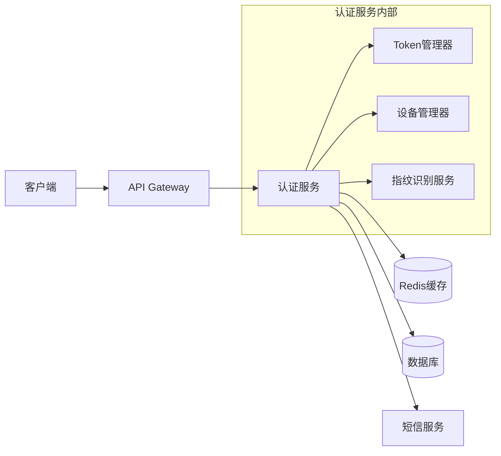
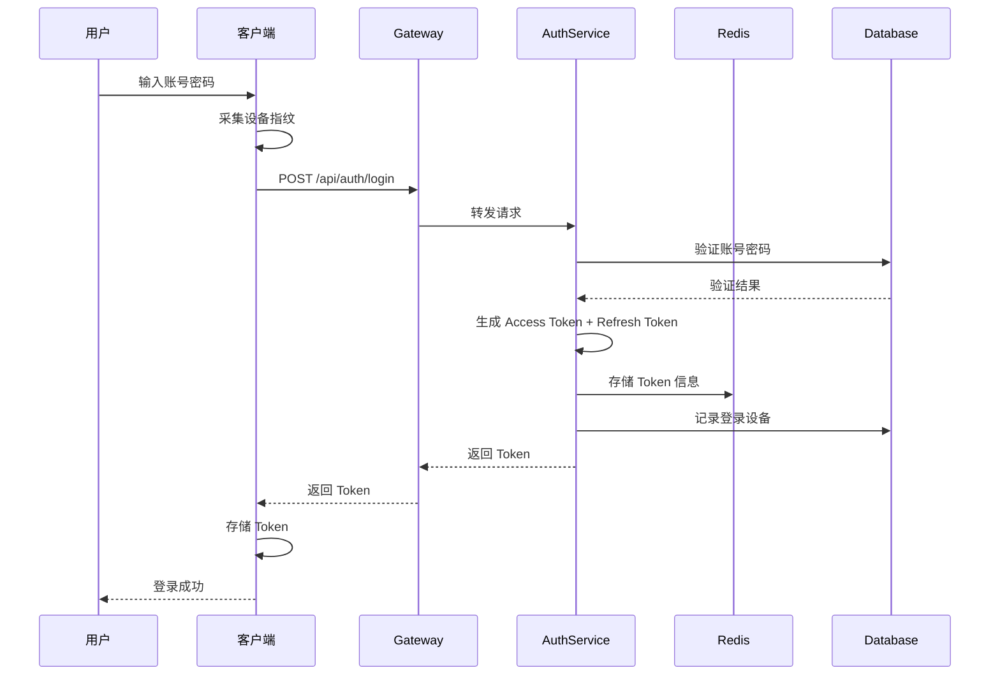
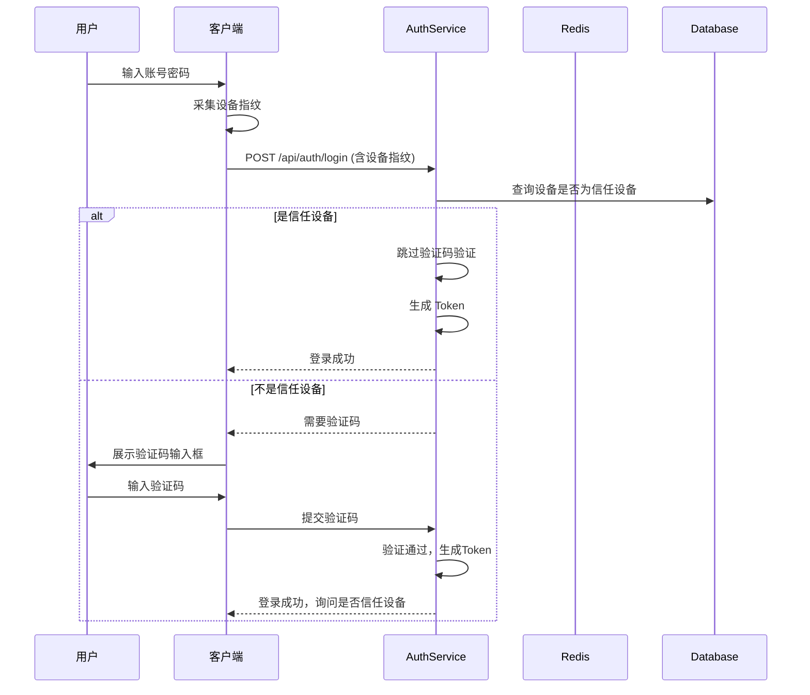
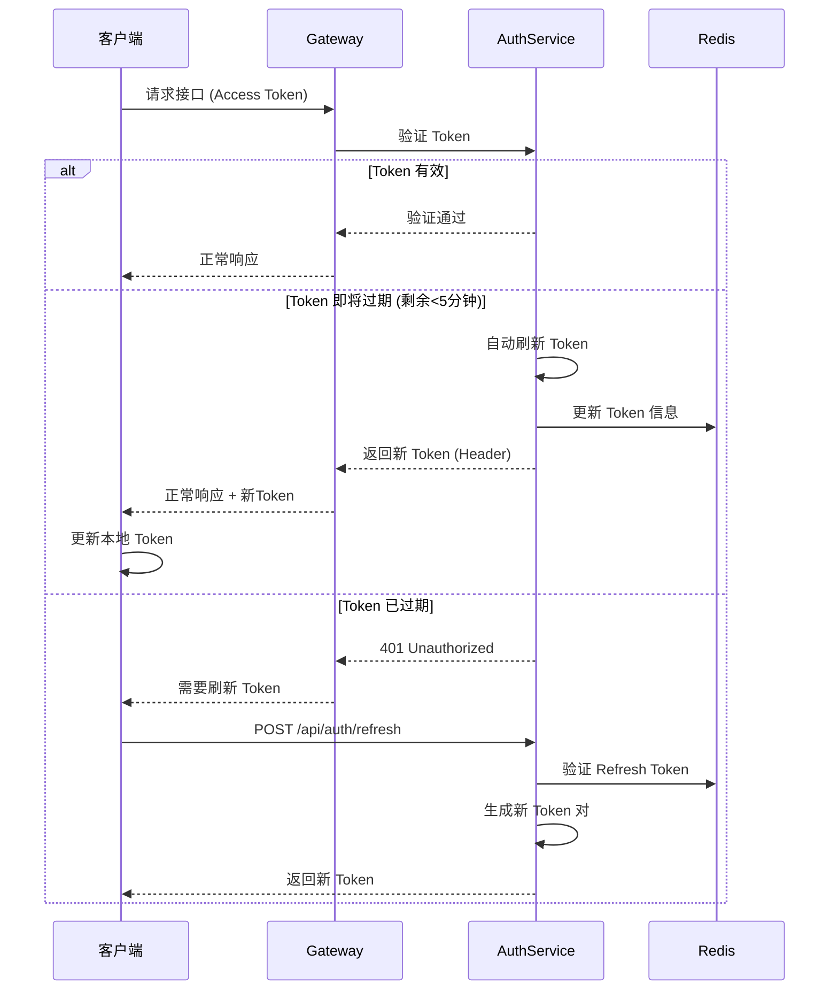
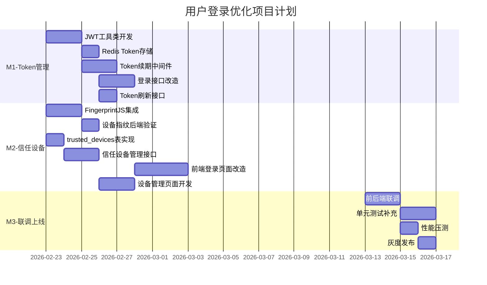

# 用户登录优化技术设计文档

| 元信息 | 值 |
|--------|-----|
| 作者 | 张三 |
| 日期 | 2026-02-20 |
| 状态 | 已通过 |
| 版本 | v1.0 |

---

## 1. 背景

### 1.1 问题描述

当前用户登录系统存在以下问题：

1. **登录流程繁琐**：用户每次访问应用都需要重新输入账号密码，体验较差
2. **缺少记住登录功能**：系统没有"记住我"或信任设备功能，导致用户频繁登录
3. **请求压力大**：日均登录请求达到 5000+ 次，其中大量为重复登录请求，造成资源浪费
4. **Token管理不完善**：Token过期后需要用户手动重新登录，无自动续期机制

### 1.2 目标

| 目标项 | 具体指标 |
|--------|----------|
| 减少重复登录 | 通过Token自动续期机制，减少80%的重复登录操作 |
| 信任设备功能 | 支持用户标记信任设备，信任设备登录免验证码 |
| 性能要求 | 登录接口P99响应时间 < 200ms |
| 安全性 | 支持设备指纹识别，异常登录告警 |

### 1.3 范围

- **包含**：登录流程优化、Token管理、信任设备管理、设备指纹识别
- **不包含**：注册流程、第三方OAuth登录、多因素认证（MFA）

---

## 2. 方案设计

### 2.1 整体架构



### 2.2 核心流程

#### 2.2.1 首次登录流程



#### 2.2.2 信任设备登录流程



#### 2.2.3 Token自动续期流程



### 2.3 技术选型

| 组件 | 技术方案 | 选型理由 |
|------|----------|----------|
| Token 方案 | JWT (RS256) | 无状态、可扩展、支持非对称加密 |
| Token 存储 | Redis Cluster | 高性能、支持过期时间、集群高可用 |
| 设备指纹 | FingerprintJS Pro | 准确率高(99.5%)、支持跨浏览器识别 |
| 缓存策略 | 本地缓存 + Redis | 减少网络开销，提升响应速度 |
| 加密算法 | AES-256-GCM | 安全性高，性能优秀 |

### 2.4 安全设计

1. **Token安全**
   - Access Token 有效期：30分钟
   - Refresh Token 有效期：7天
   - Token 绑定设备指纹，防止Token窃取

2. **设备安全**
   - 最多允许5个信任设备
   - 异地登录需要二次验证
   - 支持一键移除所有信任设备

3. **风控措施**
   - 连续5次登录失败，锁定账号15分钟
   - 异常登录行为实时告警
   - 登录日志保留90天

---

## 3. 接口定义

### 3.1 登录接口

**POST /api/auth/login**

请求体：
```json
{
    "username": "string",
    "password": "string",
    "device_fingerprint": "string",
    "remember_device": "boolean",
    "captcha_code": "string (可选)"
}
```

响应体：
```json
{
    "code": 0,
    "message": "success",
    "data": {
        "access_token": "eyJhbGciOiJSUzI1NiIs...",
        "refresh_token": "eyJhbGciOiJSUzI1NiIs...",
        "expires_in": 1800,
        "token_type": "Bearer",
        "need_captcha": false,
        "is_trusted_device": true
    }
}
```

错误码：
| 错误码 | 说明 |
|--------|------|
| 40001 | 用户名或密码错误 |
| 40002 | 账号已锁定 |
| 40003 | 需要验证码 |
| 40004 | 验证码错误 |

### 3.2 Token刷新接口

**POST /api/auth/refresh**

请求体：
```json
{
    "refresh_token": "string",
    "device_fingerprint": "string"
}
```

响应体：
```json
{
    "code": 0,
    "message": "success",
    "data": {
        "access_token": "eyJhbGciOiJSUzI1NiIs...",
        "refresh_token": "eyJhbGciOiJSUzI1NiIs...",
        "expires_in": 1800,
        "token_type": "Bearer"
    }
}
```

### 3.3 数据库表结构

#### trusted_devices 表

```sql
CREATE TABLE `trusted_devices` (
    `id` BIGINT UNSIGNED NOT NULL AUTO_INCREMENT COMMENT '主键ID',
    `user_id` BIGINT UNSIGNED NOT NULL COMMENT '用户ID',
    `device_fingerprint` VARCHAR(64) NOT NULL COMMENT '设备指纹',
    `device_name` VARCHAR(128) DEFAULT NULL COMMENT '设备名称',
    `device_type` ENUM('mobile', 'tablet', 'desktop', 'other') NOT NULL COMMENT '设备类型',
    `browser` VARCHAR(64) DEFAULT NULL COMMENT '浏览器类型',
    `os` VARCHAR(64) DEFAULT NULL COMMENT '操作系统',
    `ip_address` VARCHAR(45) DEFAULT NULL COMMENT '最后登录IP',
    `location` VARCHAR(128) DEFAULT NULL COMMENT '最后登录地点',
    `last_login_time` DATETIME DEFAULT NULL COMMENT '最后登录时间',
    `trust_expires_at` DATETIME NOT NULL COMMENT '信任过期时间',
    `status` TINYINT NOT NULL DEFAULT 1 COMMENT '状态: 1-有效, 0-已移除',
    `created_at` DATETIME NOT NULL DEFAULT CURRENT_TIMESTAMP COMMENT '创建时间',
    `updated_at` DATETIME NOT NULL DEFAULT CURRENT_TIMESTAMP ON UPDATE CURRENT_TIMESTAMP COMMENT '更新时间',
    PRIMARY KEY (`id`),
    UNIQUE KEY `uk_user_device` (`user_id`, `device_fingerprint`),
    KEY `idx_user_id` (`user_id`),
    KEY `idx_fingerprint` (`device_fingerprint`),
    KEY `idx_expires` (`trust_expires_at`)
) ENGINE=InnoDB DEFAULT CHARSET=utf8mb4 COMMENT='用户信任设备表';
```

---

## 4. 实现计划

### 4.1 里程碑

| 里程碑 | 名称 | 目标 | 截止日期 |
|--------|------|------|----------|
| M1 | Token管理 | 完成JWT Token生成、验证、自动续期功能 | 2026-03-06 |
| M2 | 信任设备 | 完成设备指纹采集、信任设备管理功能 | 2026-03-13 |
| M3 | 联调上线 | 完成前后端联调、性能测试、灰度上线 | 2026-03-20 |

### 4.2 详细任务

| 任务ID | 任务描述 | 负责人 | 预估工时 | 所属里程碑 | 依赖任务 |
|--------|----------|--------|----------|------------|----------|
| T1 | JWT工具类开发 | 张三 | 2d | M1 | - |
| T2 | Redis Token存储实现 | 张三 | 1d | M1 | T1 |
| T3 | Token自动续期中间件 | 李四 | 2d | M1 | T1, T2 |
| T4 | 登录接口改造 | 张三 | 2d | M1 | T1, T2 |
| T5 | Token刷新接口开发 | 李四 | 1d | M1 | T1, T2 |
| T6 | FingerprintJS集成 | 王五 | 2d | M2 | - |
| T7 | 设备指纹后端验证 | 张三 | 1d | M2 | T6 |
| T8 | trusted_devices表设计与实现 | 李四 | 1d | M2 | - |
| T9 | 信任设备管理接口 | 李四 | 2d | M2 | T7, T8 |
| T10 | 前端登录页面改造 | 王五 | 3d | M2 | T4, T6 |
| T11 | 设备管理页面开发 | 王五 | 2d | M2 | T9 |
| T12 | 前后端联调 | 全员 | 2d | M3 | T1-T11 |
| T13 | 单元测试补充 | 张三 | 2d | M3 | T12 |
| T14 | 性能压测 | 李四 | 1d | M3 | T12 |
| T15 | 灰度发布 | 全员 | 1d | M3 | T13, T14 |

### 4.3 甘特图



---

## 5. 风险与依赖

### 5.1 风险评估

| 风险项 | 风险等级 | 影响 | 应对措施 |
|--------|----------|------|----------|
| FingerprintJS Pro许可证费用超预算 | 中 | 可能影响设备指纹准确率 | 准备开源方案作为备选 |
| Token续期逻辑复杂导致安全漏洞 | 高 | 可能导致Token泄露风险 | 邀请安全团队代码审查 |
| 前端改动影响现有登录流程 | 中 | 可能影响用户登录体验 | 制定详细的灰度方案 |
| Redis集群故障 | 低 | 可能导致登录失败 | 配置本地缓存降级方案 |

### 5.2 依赖项

| 依赖项 | 依赖方 | 状态 | 备注 |
|--------|--------|------|------|
| FingerprintJS Pro许可证 | 采购部门 | 待审批 | 预计2026-02-25完成 |
| Redis集群扩容 | 运维团队 | 已完成 | 新增2个节点 |
| 短信服务接口 | SMS团队 | 已就绪 | 使用现有接口 |
| 安全审查 | 安全团队 | 待排期 | 需在M3前完成 |

---

## 6. 附录

### 6.1 参考文档

- [JWT RFC 7519](https://tools.ietf.org/html/rfc7519)
- [FingerprintJS 官方文档](https://fingerprint.com/docs/)
- [Redis 集群最佳实践](https://redis.io/docs/management/scaling/)

### 6.2 术语表

| 术语 | 解释 |
|------|------|
| Access Token | 访问令牌，用于API鉴权，有效期短 |
| Refresh Token | 刷新令牌，用于获取新的Access Token，有效期长 |
| 设备指纹 | 通过采集设备特征生成的唯一标识符 |
| P99 | 99%请求的响应时间，用于衡量接口性能 |

### 6.3 变更记录

| 版本 | 日期 | 作者 | 变更内容 |
|------|------|------|----------|
| v0.1 | 2026-02-15 | 张三 | 初稿 |
| v0.2 | 2026-02-18 | 张三 | 根据评审意见修改Token方案 |
| v1.0 | 2026-02-20 | 张三 | 评审通过，定稿 |
