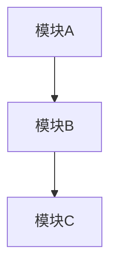

# [功能名称] 技术设计文档

> 作者：[姓名]
> 日期：[YYYY-MM-DD]
> 状态：草稿 | 评审中 | 已通过

---

## 1. 背景

### 1.1 问题描述

[描述当前的痛点和要解决的问题。用 1-2 段话，让非技术人员也能理解。]

### 1.2 目标

[明确本次设计要达成的目标，最好有可量化的指标。]

- 目标 1：...
- 目标 2：...

---

## 2. 方案设计

### 2.1 整体架构

[插入架构图，使用 Mermaid 语法]



### 2.2 核心流程

[描述主要的业务/技术流程]

1. 步骤一：...
2. 步骤二：...
3. 步骤三：...

### 2.3 技术选型

| 组件 | 选择 | 理由 |
|------|------|------|
| [组件1] | [技术/框架] | [为什么选择] |
| [组件2] | [技术/框架] | [为什么选择] |

---

## 3. 接口定义

### 3.1 API 接口

**[接口名称]**

- 路径：`[METHOD] /api/xxx`
- 描述：[接口功能描述]

请求参数：
```json
{
  "field1": "string, 必填, 描述",
  "field2": "number, 可选, 描述"
}
```

响应：
```json
{
  "code": 0,
  "message": "success",
  "data": {
    "field": "value"
  }
}
```

错误码：
| 错误码 | 说明 |
|--------|------|
| 1001 | [错误描述] |
| 1002 | [错误描述] |

### 3.2 数据结构

[表结构或数据模型定义]

| 字段 | 类型 | 说明 |
|------|------|------|
| id | bigint | 主键 |
| name | varchar(100) | 名称 |
| created_at | datetime | 创建时间 |

---

## 4. 实现计划

### 4.1 里程碑

| 阶段 | 目标 | 预计时间 |
|------|------|----------|
| M1 | [阶段目标] | [x 天] |
| M2 | [阶段目标] | [x 天] |

### 4.2 详细任务

| 任务 | 负责人 | 预计时间 | 依赖 |
|------|--------|----------|------|
| [任务1] | [姓名] | [x 天] | - |
| [任务2] | [姓名] | [x 天] | 任务1 |

---

## 5. 风险与依赖

| 风险/依赖 | 影响 | 应对措施 |
|-----------|------|----------|
| [风险描述] | [影响说明] | [应对方案] |

---

## 附录

[可选：补充说明、参考资料、术语表等]
